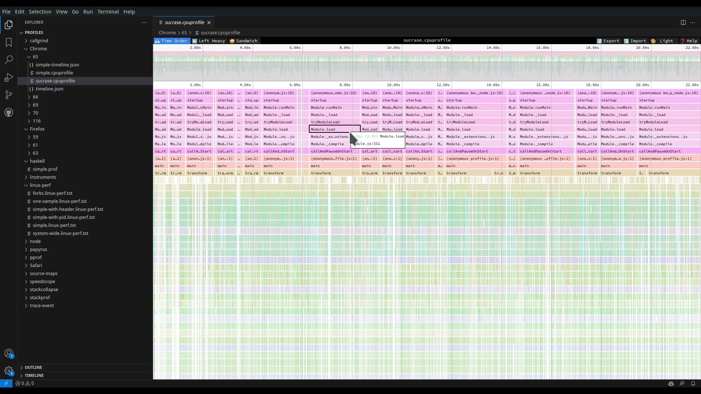

# Speedscope in VScode

View speedscope flamegraphs in VSCode.

[Speedscope](https://www.speedscope.app/) is:

> A fast, interactive web-based viewer for performance profiles.
> An alternative viewer for FlameGraphs.
> Will happily display multi-megabyte profiles without crashing your browser.
>
> from https://github.com/jlfwong/speedscope

## Installation

[Install from VSCode marketplace](https://marketplace.visualstudio.com/items?itemName=sransara.speedscope-in-vscode)

## Screenshot

## Features

This extension extends [speedscope](https://github.com/jlfwong/speedscope) to be viewable from VSCode.

- Open [speedscope compatible files](https://github.com/jlfwong/speedscope/wiki)
  - Right click particular file in VSCode File Explorer
  - Select "Open with..."
  - Select "Speedscope"
- Support opening remote files
  - Use "Open with..." from VSCode File Explorer like a local file
- Open a Speedscope view with command: `speedscope-in-vscode.openSpeedscope`

### TODO

- Only files can be opened at the moment.
  Allow directories as inputs to support opening [Instruments traces](https://help.apple.com/instruments/mac/10.0/).

## Development

See [DEVELOPMENT.md](DEVELOPMENT.md) for development and implementation details.
